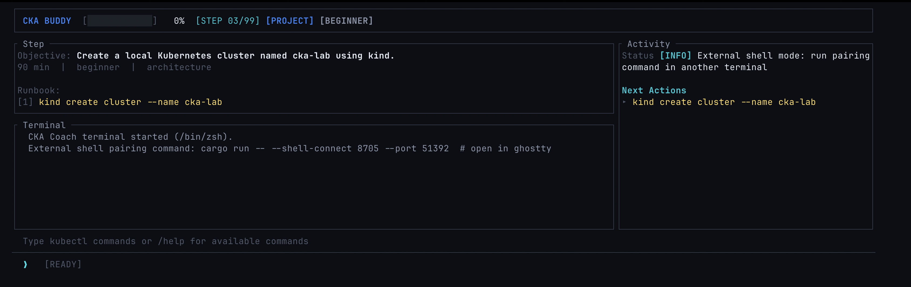
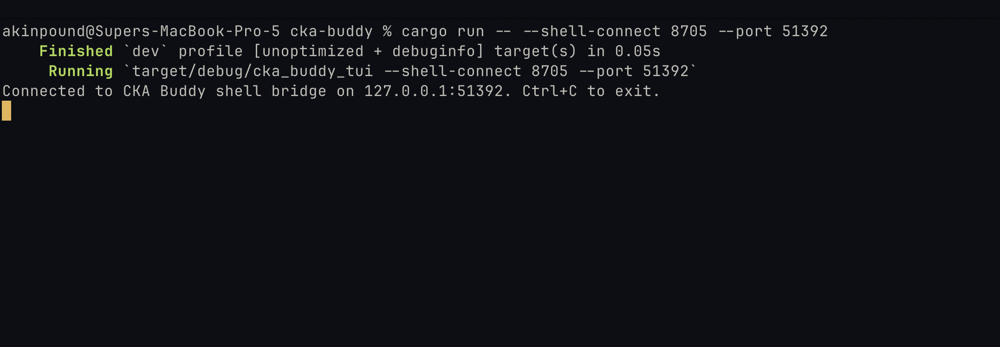

# CKA Buddy (Rust TUI)

CKA Buddy is a local-first, hands-on Kubernetes coaching app for CKA prep.

It gives you:
- guided step-by-step project content,
- deterministic verification,
- persistent progress,
- and a TUI control plane while you run real shell commands in a paired terminal.

## Screenshots

### Splash


### Learning UI




---

## Default workflow (new)

`cargo run` now defaults to **external shell mode**.

That means:
1. You launch CKA Buddy in one terminal.
2. CKA Buddy shows a **4-digit PIN pairing command** in the log.
3. You run that pairing command in a second terminal.
4. All commands from the TUI execute in that paired terminal (no terminal spam/popups).

### Start app (default external mode)

```bash
cargo run
```

### Target a specific terminal emulator quickly

Use a positional argument:

```bash
cargo run -- ghostty
```

Equivalent explicit form:

```bash
cargo run -- --shell external --terminal ghostty
```

### Pairing helper command (generated by app)

You’ll see something like:

```bash
cargo run -- --shell-connect 4821 --port 51234
```

Run it in your second terminal to connect.

---

## Shell modes

- **Default:** `external`
- Optional: `embedded`

Force embedded mode:

```bash
cargo run -- --shell embedded
```

Switch at runtime inside TUI:
- `/shell` → show current mode
- `/shell embedded`
- `/shell external`

---

## Core in-app commands

- `/new` — reset progress and restart from Project 00
- `/next` / `/prev` — navigate steps
- `/back` — jump to last completed step
- `/recommended` — jump to recommended next step
- `/verify` — run deterministic checks for current step
- `/hint` — get contextual coach hint
- `/suggest [n]` — load suggested command
- `/clear` — clear terminal feed
- `/help` — show command reference
- `/quit` — save and exit

You can also type normal shell/kubectl commands directly.

For guard overrides on risky commands:

```text
! <command>
```

---

## Quit

- **Ctrl+C** works globally (quick quit from anywhere)
- `/quit` also exits cleanly

---

## Project purpose

CKA Buddy is designed to reduce exam prep friction:
- learn by doing,
- keep commands and verification deterministic,
- avoid context switching,
- keep progress and momentum across sessions.

---

## Content + progress

- Content source: `docs/cka-app-content/`
- Progress file: `~/.cka-coach/progress.json`
- Verification source: step `verify` commands in content

### Strict runnable blocks

Project and bug markdown files support `cka-step` fenced blocks for exact runnable steps.

---

## Optional LLM coach

Default coaching is deterministic (no API required).

Enable LLM hints:

```bash
cargo run --features llm
```

Set environment variables:

```bash
export CKA_COACH_LLM_API_KEY="<key>"
export CKA_COACH_LLM_ENDPOINT="https://openrouter.ai/api/v1/chat/completions"
export CKA_COACH_LLM_MODEL="openai/gpt-4.1-mini"
```

If using another OpenAI-compatible endpoint, set `CKA_COACH_LLM_ENDPOINT` accordingly.
